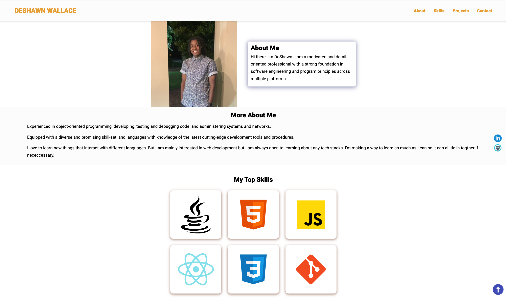

# DEVELOPER PORTFOLIO

A portfolio website designed about me

## Github repo

This is the [link](https://github.com/wallacee93/developer_portfolio) to the Github repo of the project

## Tech Stack

**Client:** HTML, CSS, Vanilla JavaSCript

## Tools Used

Below are are list of tools used, and the precise things they were used for:

- [Ion Icons](https://ionic.io/ionicons) for hambuger menu bar
- [Icon8](https://icons8.com/) for animated icons and skills icons
- [Animate CSS](https://animate.style/) for Jane Doe's bio text animation
- [Formspree](https://formspree.io/) for contact form submision and straight delivery to Gmail
